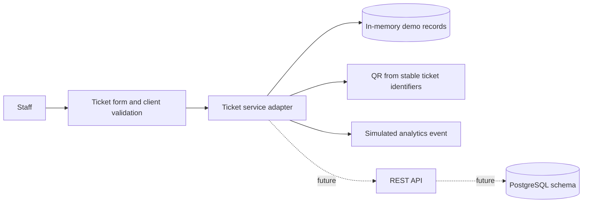

# Architecture notes

## Scope

This deliverable includes a lightweight React/Vite worker UI and an architectural plan for a later service. There is no API server, authentication implementation, durable storage, or real analytics pipeline in this project. `src/services/tickets.js` is the seam for a future API client and currently simulates a short network delay with process-local in-memory ticket data.

## Request flow

Each field is sanitized as text on change, trimmed and validated again before submission. The service returns a structured ticket; the UI renders a QR and adds the record to its current-session history. React renders user values as text; no raw HTML is inserted. The analytics event is a console event only.

## Demo connectivity

Normal creation waits briefly to make the accessible busy state observable. Add `?slow` to the URL for a longer delay. To make the next request fail, run `sessionStorage.setItem('ticketWorker.failNext', 'true')` in the browser console; the UI retains the entered details and offers retry. This toggle is for local demonstration only.

## Follow-on implementation

Replace the service functions with `fetch` calls using the documented envelopes. Keep validation at both layers. Populate `createdBy` from the authenticated principal on the server; do not place staff identity or ticket details in analytics events. Persist ticket creation and its `created` event transactionally. Use cursor pagination for the history endpoint.
