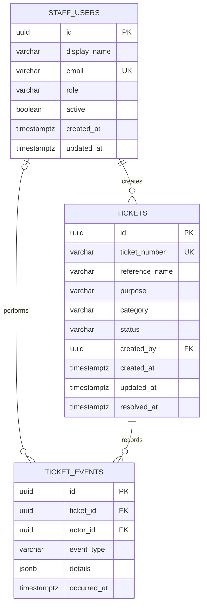

# Database schema

This is the proposed relational schema for a future API-backed deployment. The current worker uses transient in-memory data; it does not connect to a database.

## PostgreSQL DDL

```sql
CREATE TABLE staff_users (
  id           UUID PRIMARY KEY DEFAULT gen_random_uuid(),
  display_name VARCHAR(120) NOT NULL,
  email        VARCHAR(254) NOT NULL UNIQUE,
  role         VARCHAR(32) NOT NULL DEFAULT 'floor_staff'
               CHECK (role IN ('floor_staff', 'supervisor', 'admin')),
  active       BOOLEAN NOT NULL DEFAULT TRUE,
  created_at   TIMESTAMPTZ NOT NULL DEFAULT now(),
  updated_at   TIMESTAMPTZ NOT NULL DEFAULT now()
);

CREATE TABLE tickets (
  id             UUID PRIMARY KEY DEFAULT gen_random_uuid(),
  ticket_number  VARCHAR(12) NOT NULL UNIQUE
                 CHECK (ticket_number ~ '^TKT-[0-9]{4,8}$'),
  reference_name VARCHAR(80) NOT NULL,
  purpose        VARCHAR(240) NOT NULL,
  category       VARCHAR(32) NOT NULL
                 CHECK (category IN ('Facilities', 'Guest services', 'Food & beverage', 'Safety', 'Other')),
  status         VARCHAR(16) NOT NULL DEFAULT 'open'
                 CHECK (status IN ('open', 'in_progress', 'resolved', 'cancelled')),
  created_by     UUID NOT NULL REFERENCES staff_users(id) ON DELETE RESTRICT,
  created_at     TIMESTAMPTZ NOT NULL DEFAULT now(),
  updated_at     TIMESTAMPTZ NOT NULL DEFAULT now(),
  resolved_at    TIMESTAMPTZ NULL
);

CREATE TABLE ticket_events (
  id          UUID PRIMARY KEY DEFAULT gen_random_uuid(),
  ticket_id   UUID NOT NULL REFERENCES tickets(id) ON DELETE CASCADE,
  actor_id    UUID NULL REFERENCES staff_users(id) ON DELETE SET NULL,
  event_type  VARCHAR(32) NOT NULL
              CHECK (event_type IN ('created', 'status_changed', 'details_updated', 'deleted')),
  details     JSONB NOT NULL DEFAULT '{}'::jsonb,
  occurred_at TIMESTAMPTZ NOT NULL DEFAULT now()
);

CREATE INDEX tickets_created_at_id_idx ON tickets (created_at DESC, id DESC);
CREATE INDEX tickets_status_created_at_idx ON tickets (status, created_at DESC);
CREATE INDEX ticket_events_ticket_occurred_idx ON ticket_events (ticket_id, occurred_at DESC);
```

## Constraints and relationships

| Table | Key fields | Nullable | Constraints and indexes |
|---|---|---|---|
| `staff_users` | `id` PK | none except no optional profile data | Email is unique; role is constrained; active staff can create tickets. |
| `tickets` | `id` PK; `created_by` FK | `resolved_at` | Ticket number is unique and format checked. Creator delete is restricted. Status/category are constrained. History/status indexes support recent list and filtering. |
| `ticket_events` | `id` PK; `ticket_id`, `actor_id` FKs | `actor_id` | Ticket deletion cascades to its events; deleting an actor preserves event history with a null actor. Ticket/time index supports audit timeline. |

One staff user creates many tickets. One ticket has many events. A ticket has exactly one creator. Staff identity comes from authenticated server context; clients must not choose `created_by`. Database timestamps are UTC.

The QR code should encode a stable ticket URL or opaque identifier (for example `/tickets/{id}`), not personal details. The prototype currently encodes the record UUID and ticket number as compact JSON; a backend rollout should switch to an authenticated/deep-link URL and decide access policy.

## Mermaid ERD


